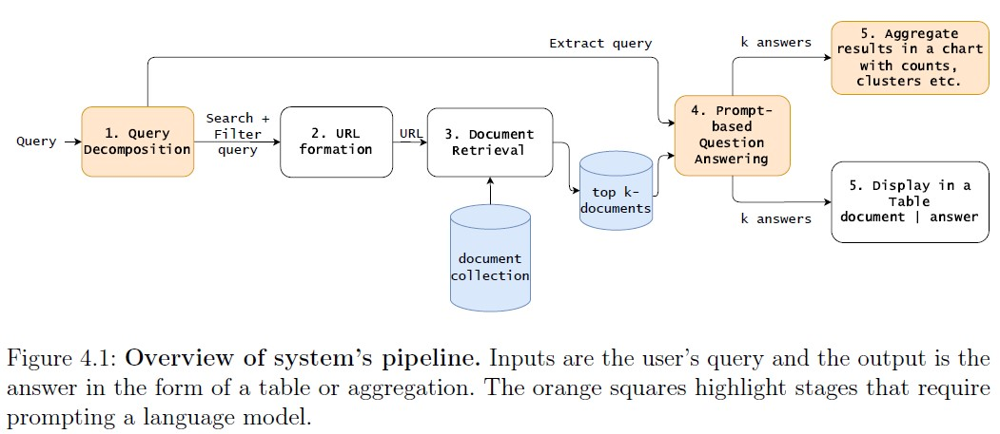
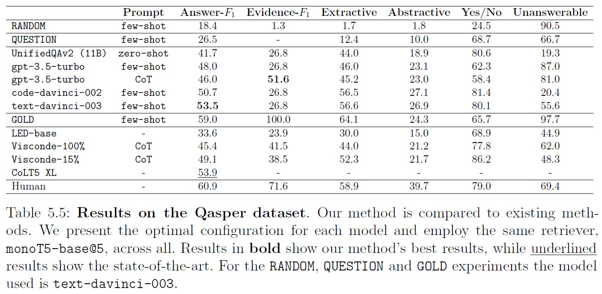
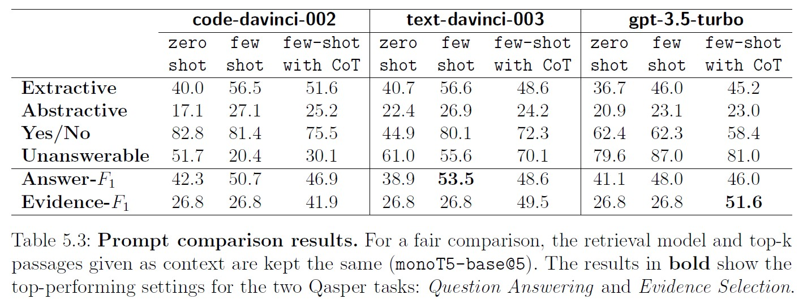
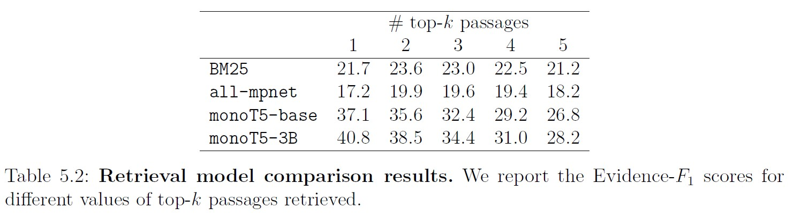
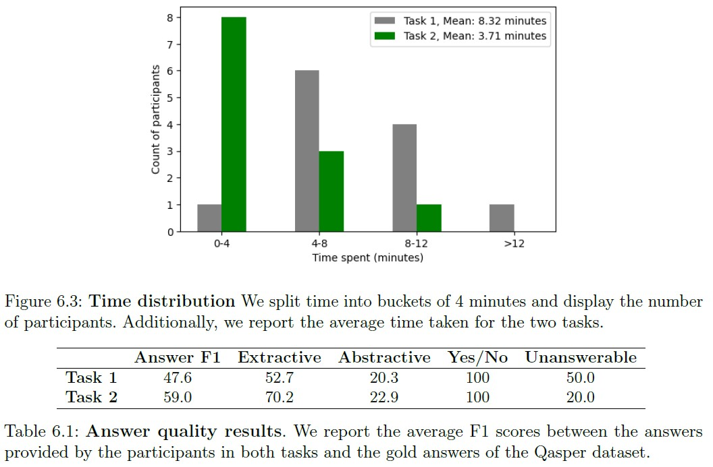

# Retrieval Augmented Generation of Tabular Answers at Query Time using Pre-trained Large Language Models

## Abstract
Question-Answering systems typically generate answers in the form of sentences or paragraphs, but some situations call for a more structured representation of information. Our research addresses the challenge of table generation for domain-specific question-answering. Given a collection of documents and a query, our objective is to present the relevant documents and extracted answers in a tabulated or aggregated format. To accomplish this, we propose a novel five-step system pipeline called Search-Filter-Generate. We leverage the GPT 3.5 family of Large Language Models and employ prompt-engineering techniques such as zero-shot, few-shot, and few-shot with Chain-of-Thought (CoT) to accurately generate factual answers. Additionally, we investigate the influence of context passages on answer generation by comparing sparse, dense retrieval, and reranking models. Our system's performance is evaluated on Qasper, a question-answering dataset focused on scientific papers. The results demonstrate that GPT3.5 models, augmented with passages retrieved from a state-of-the-art cross-encoder, perform comparably to fine-tuned models specifically designed for this task. Furthermore, we show that few-shot with CoT prompting effectively improves performance in the Evidence Selection task. Finally, we conduct a preliminary user study to assess the productivity impact of this Question-Answering system. The findings reveal a significant average time reduction of 55.4% and an average answer quality improvement of 23.9%.

## Search-Filter-Generate


## Results

### Experiment: Prompt-based Question Answering




### Experiment: Productivity Effects of Question-Answering Models


## Replication
Download dataset:
```
cd data/qasper
wget https://qasper-dataset.s3.us-west-2.amazonaws.com/qasper-test-and-evaluator-v0.3.tgz
tar -xf qasper-test-and-evaluator-v0.3.tgz
```
You can replicate all results on Qasper by running the following command:
```
python generate_answers.py --model {MODEL_NAME} --retrieval_method {RETRIEVAL_NAME} --prompt_filename {PROMPT_NAME} --top_k_passages {TOP_K}
```
Where:
- `MODEL_NAME`: the name of the LLM to use (defaults to "text-davinci-003")
- `RETRIEVAL_NAME`: the name of the retrieval mode to use 
- `PROMPT_NAME`: the name of the prompt strategy to use
- `TOP_K`: the number of passages to retrieve (defaults to 5)

For example to replicate the setting monot5-base@5 + text-davinci-003 + few-shot run the following:
```
python generate_answers.py --model text-davinci-003 --retrieval_method monot5-base-msmarco-10k --prompt_filename qasper_fewshot_prompt
```
For convenience, we have uploaded the .jsonl files containing the generated answers and created a notebook containing all Prompt-based Question Answering result tables: [result_tables.ipynb](result_tables.ipynb).

The user study results on the experiment Productivity Effects of Question-Answering Models can be found in this notebook: [results.ipynb](productivity%20experiment/results.ipynb).

For a forward pass of the Search-Filter-Generate pipeline run the following command:

```
python main.py --query {QUERY_NAME}
```
- `QUERY_NAME`: the name of the query to use, examples can be found under [tabular_queries_collection.csv](data/tabular_queries_collection.csv)

Use ```--aggregate``` if you wish to aggregate results with [BERTopic](https://maartengr.github.io/BERTopic/index.html). Examples can be found under [clusters](clusters).

